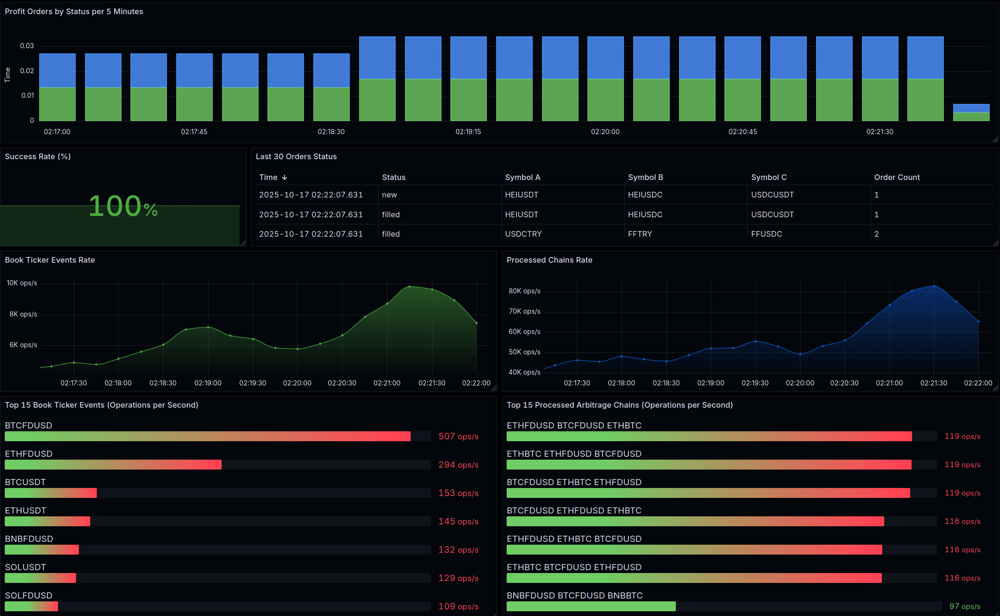

# arb-bot-rs


Arbitrage bot is a high-frequency arbitrage trading system that automatically identifies and executes profitable
triangular arbitrage opportunities on cryptocurrency exchanges.

Full documentation of the project can be found [here](https://github.com/mkbeh/arb-bot-rs/tree/main/docs).

### Supports

List of supported cryptocurrency exchanges.

| Exchange | Status  |
|:--------:|:-------:|
| Binance  | &check; |

### Content

* [Installation](#installation)
* [Usage](#usage)
* [Monitoring](#monitoring)
* [Translations](#translations)

## Installation

Application is written in Rust, so you'll need to grab a
[Rust installation](https://www.rust-lang.org/) in order to compile it.
Application compiles with Rust 1.88.0 (stable) or newer.

### Build from source

```shell
git clone https://github.com/mkbeh/arb-bot-rs.git
cd arb-bot-rs
cargo build --release
```

## Usage

Fill in the [example](https://github.com/mkbeh/arb-bot-rs/blob/main/config.example.toml) config file and rename the
file to `config.toml`.

_For a test run, you do not need to specify your API tokens. You only need to specify API tokens if you toggle the flag
`send_orders = true`._

Run app:

```shell
target/release/bot 2>&1 | tee debug_$(date "+%Y.%m.%d-%H.%M.%S").log
```

### Docker

Build image:

```shell
docker build --build-arg SERVICE_NAME=bot --build-arg BUILD_PROFILE=release -t arb-bot-rs:latest .
```

Run app:

```shell
docker run --cpus="1" --cpuset-cpus="0" --memory="512m" arb-bot-rs:latest
```

## Monitoring


The bot's core performance is monitored in real-time using a Grafana dashboard, providing deep insights into market data
processing and arbitrage efficiency.

### 📊 Key Metrics Tracked

| **Metric**                                                                                  | **Description**                                             |
|---------------------------------------------------------------------------------------------|-------------------------------------------------------------|
| **📈 Market Data Intensity**                                                                |                                                             |
| - Total rate of order book update events from exchanges                                     | 🔄 Rate of updates received from various exchanges.         |
| - The most active trading pairs by update frequency                                         | 💱 Top pairs with the highest volume of order book changes. |
| **⚡ Arbitrage Engine Performance**                                                          |                                                             |
| - How many potential arbitrage chains the engine analyzes per second                        | ⏱️ Chains processed per second for opportunity detection.   |
| - The most frequently processed and profitable currency chains                              | 💰 Top chains by frequency and average profitability.       |
| **🎯 Trading Strategy Effectiveness**                                                       |                                                             |
| - The percentage of profitable chains found versus all chains processed                     | 📊 Success rate of profitable detections (%).               |
| - The absolute count of profitable opportunities identified                                 | ✅ Total number of viable arbitrage opportunities found.     |
| **🛠️ Order Execution Status**                                                              |                                                             |
| - A real-time log of the most recent order execution attempts (success, failure, cancelled) | 📝 Latest executions with status and timestamps.            |

### Dashboard Preview

The dashboard provides a live look at the bot's decision-making process and market impact.



_Live dashboard showing market data throughput, arbitrage processing rates, and trading performance._

## Running tests

Application is relatively well-tested, including both unit tests and integration tests. To run the full test suite, use:

```shell
cargo test --all
```

## Translations

The following is a list of known translations of application documentation.

* [English](https://github.com/mkbeh/arb-bot-rs/tree/main/docs/en)
