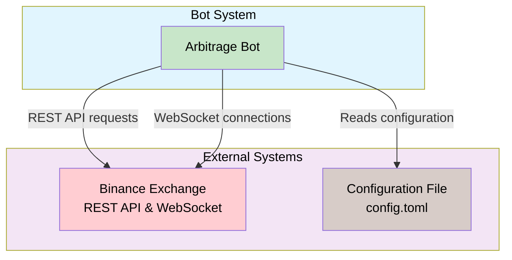
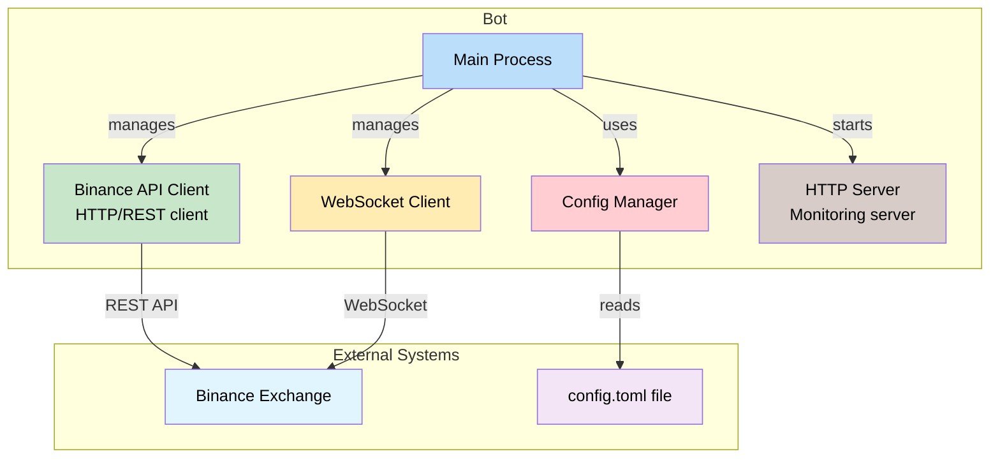
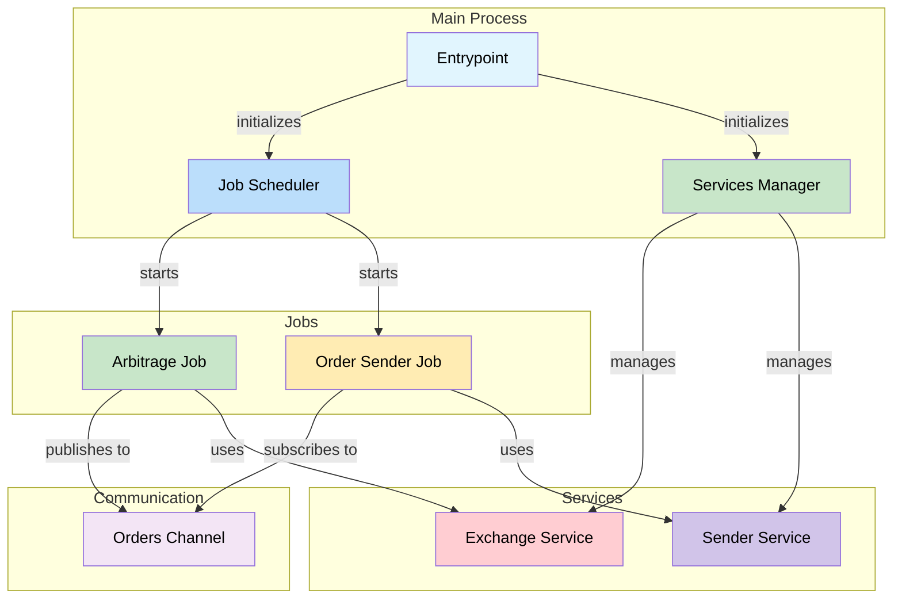
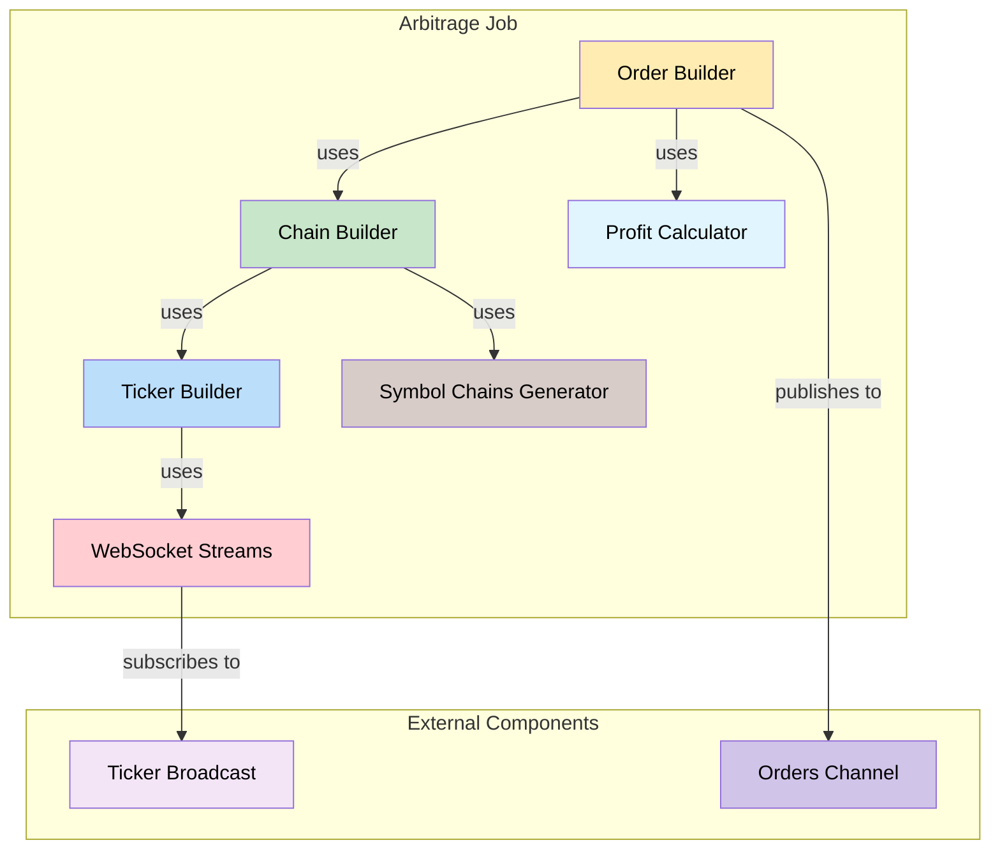
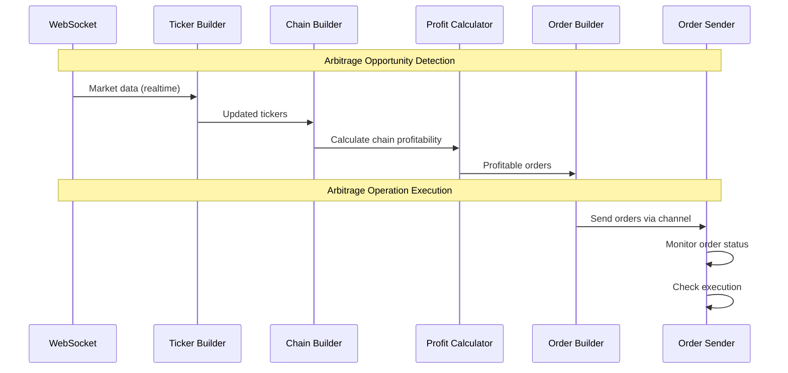
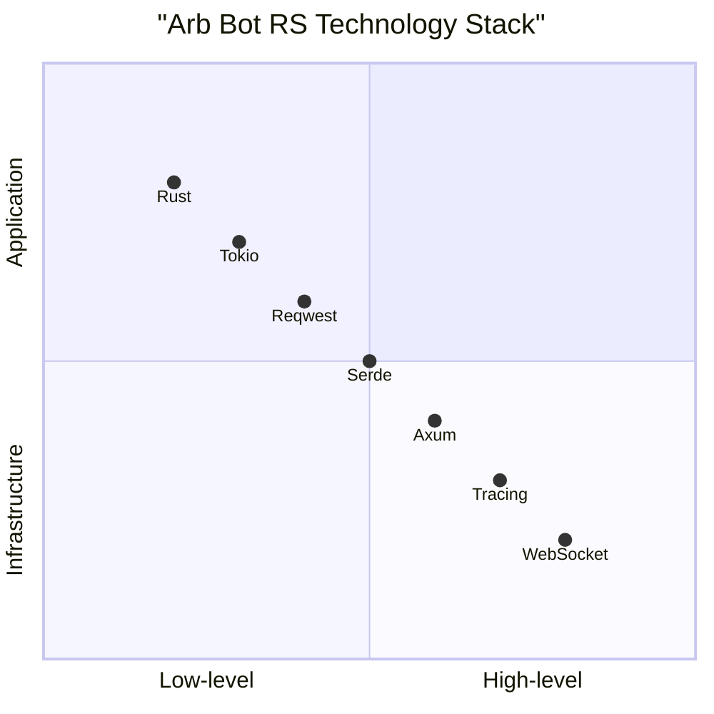

# arb-bot-rs


Arbitrage bot for cryptocurrency exchanges which uses the triangular arbitrage algorithm.

Full description of the algorithm used can be found [here](https://github.com/mkbeh/arb-bot-rs/tree/main/docs).

### Supports

List of supported cryptocurrency exchanges.

| Exchange | Status  |
|:--------:|:-------:|
| Binance  | &check; |

### Content

* [Project design](#project-design)
* [Installation](#installation)
* [Usage](#usage)
* [Translations](#translations)

## Project design

### Context Diagram (Level 1)



### Container Diagram (Level 2)



### Component Diagram (Level 3)



### Arbitrage Job Component Diagram (Level 4)



### Arbitrage Operation Sequence Diagram



### Technology Stack



## Installation

Application is written in Rust, so you'll need to grab a
[Rust installation](https://www.rust-lang.org/) in order to compile it.
Application compiles with Rust 1.88.0 (stable) or newer.

### Build from source

```shell
git clone https://github.com/mkbeh/arb-bot-rs.git
cd arb-bot-rs
cargo build --release
```

## Usage

Fill in the [example](https://github.com/mkbeh/arb-bot-rs/blob/main/config.example.toml) config file and rename the
file to `config.toml`.

*

*_For a test run, you do not need to specify your API tokens. You only need to specify API tokens if you toggle the flag
`send_orders = true`._**

Run app:

```shell
target/release/bot 2>&1 | tee debug_$(date "+%Y.%m.%d-%H.%M.%S").log
```

### Docker

Build image:

```shell
docker build --build-arg SERVICE_NAME=bot --build-arg BUILD_PROFILE=release -t arb-bot-rs:latest .
```

Run app:

```shell
docker run --cpus="1" --cpuset-cpus="0" --memory="256m" arb-bot-rs:latest
```

## Running tests

Application is relatively well-tested, including both unit tests and integration tests. To run the full test suite, use:

```shell
cargo test --all
```

## Translations

The following is a list of known translations of application documentation.

* [English](https://github.com/mkbeh/arb-bot-rs/tree/main/docs/en)
