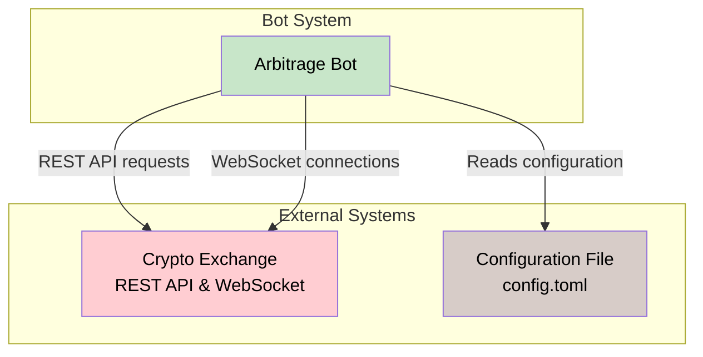
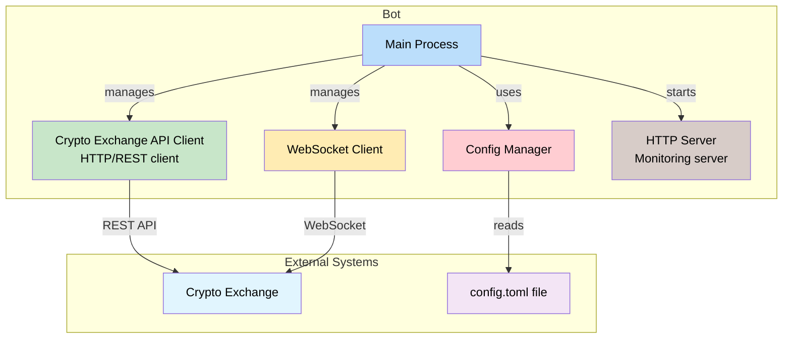
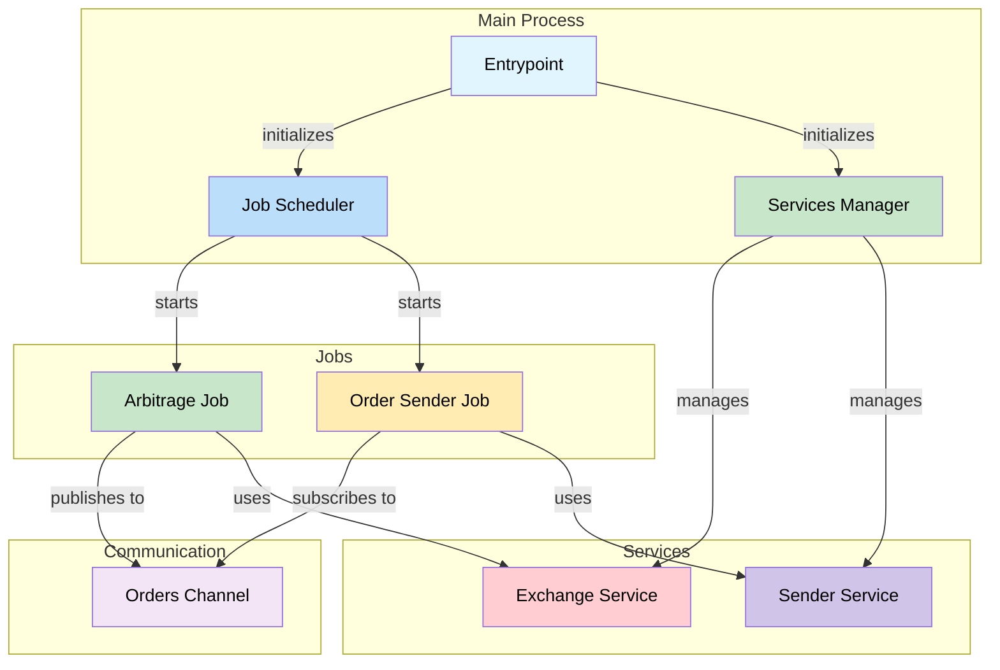
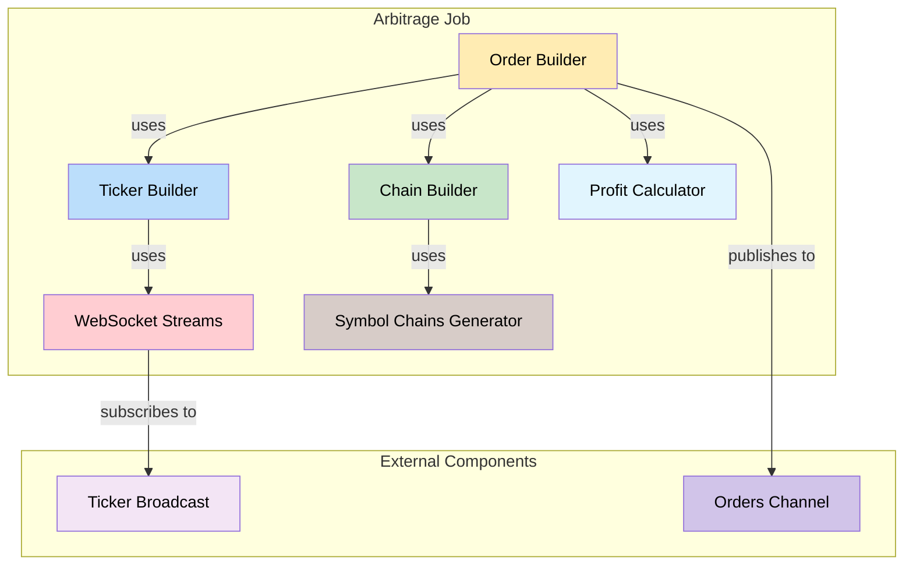
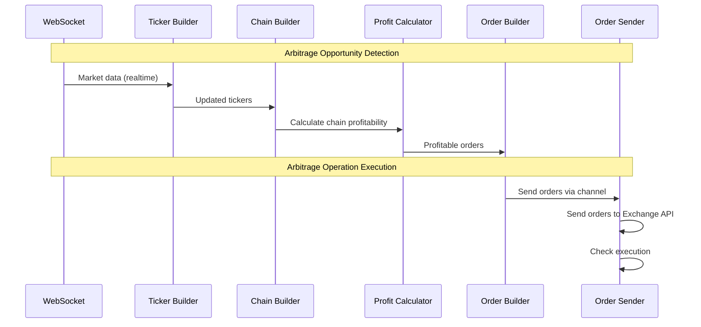
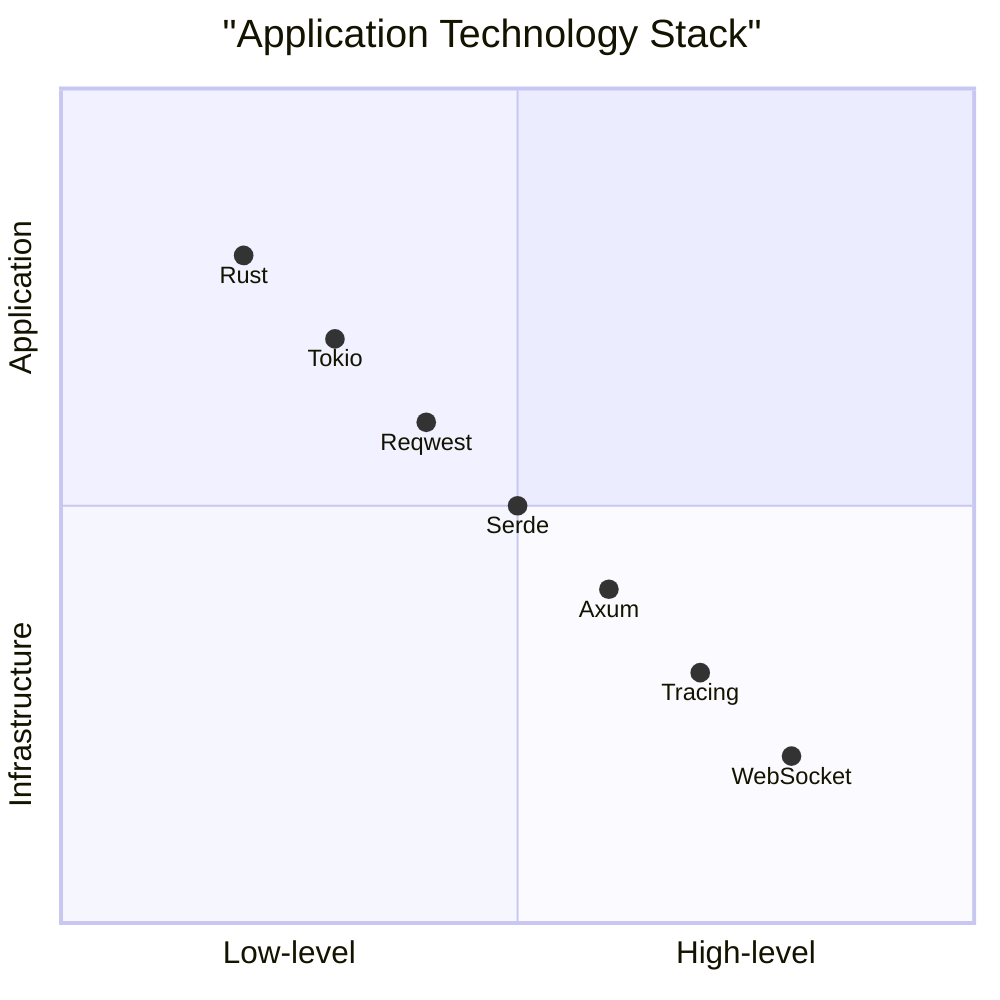

# System overview

This architecture enables high-frequency arbitrage trading with robust error handling, real-time processing, and
comprehensive monitoring capabilities while maintaining modularity and scalability.

### 📊 Architecture Levels

This C4 model provides a comprehensive visual documentation of the crypto arbitrage bot's architecture, from high-level
system context down to detailed component interactions and data flow sequences.

#### Level 1 - Context

* **Core System:** Arbitrage Bot
* **External Dependencies:** Cryptocurrency Exchange (REST+WebSocket), Configuration File
* **Primary Flow:** Real-time market data → Arbitrage detection → Order execution

#### Level 2 - Containers

* **Main Process:** Orchestrates all components
* **Cryptocurrency API Client:** Handles REST API communications
* **WebSocket Client:** Manages real-time data streams
* **Config Manager:** Processes configuration settings
* **HTTP Server:** Provides health monitoring endpoints

#### Level 3 - Components

* **Arbitrage Job:** Core arbitrage detection logic
* **Order Sender Job:** Order execution management
* **Exchange Service:** Market data processing
* **Sender Service:** Risk-managed order execution
* **Orders Channel:** Pub/Sub communication bus

#### Level 4 - Code (Arbitrage Job)

* **Ticker Builder:** Processes real-time price data from WebSocket
* **Chain Builder:** Identifies arbitrage chains using symbol information
* **Profit Calculator:** Validates profitability of arbitrage opportunities
* **Order Builder:** Generates executable orders (uses Ticker Builder for prices, Chain Builder for chains, and Profit
  Calculator for validation)

### ⚡ Key Data Flows

* **Market Data:** WebSocket → Ticker Builder → Order Builder
* **Arbitrage Detection:** Chain analysis → Profit validation → Order generation
* **Order Execution:** Orders Channel → Sender Service → Cryptocurrency Exchange API
* **Monitoring:** Continuous status checks → Performance metrics

### 🛡️ Quality Attributes

* **Performance:** Low-latency real-time processing
* **Reliability:** Automatic reconnections and error handling
* **Maintainability:** Modular design with clear separation of concerns
* **Monitorability:** Comprehensive logging and metrics

### 🎪 Deployment

* **Single Container:** Docker-based deployment
* **External Dependencies:** Cryptocurrency Exchange API endpoints
* **Monitoring:** Integrated health checks and metrics

### 🎯 Context Diagram (Level 1)

**System Scope & External Dependencies**

_High-level overview showing the arbitrage bot interacting with external systems including cryptocurrency exchanges via
REST API and WebSocket connections, and local configuration management._

### 🏗️ Container Diagram (Level 2)

**Internal Component Organization**

_Detailed breakdown of the bot's internal architecture showing how the main process orchestrates API clients, WebSocket
connections, configuration management, and monitoring services._

### ⚙️ Component Diagram (Level 3)

**Service Architecture & Communication**

_Component-level design illustrating how jobs and services interact through message channels, showing the separation
between arbitrage detection and order execution responsibilities._

### 🔍 Arbitrage Job Component Diagram (Level 4)

**Core Arbitrage Engine Details**

_Deep dive into the arbitrage detection logic showing how ticker data flows through the chain building, profit
calculation, and order generation pipeline._

### ⚡ Arbitrage Operation Sequence Diagram

**Real-time Execution Flow**

_Step-by-step sequence showing how market data is processed through the arbitrage pipeline from WebSocket reception to
order execution._

### 🛠️ Technology Stack Diagram

**Foundation & Specialized Tools**

_Visualization of the technology choices showing the progression from low-level infrastructure components to high-level
application frameworks, highlighting Rust as the core language and Tokio for async operations._

This technology stack combines Rust's performance advantages with modern async capabilities and comprehensive monitoring
tools, creating a robust foundation for high-frequency trading operations.